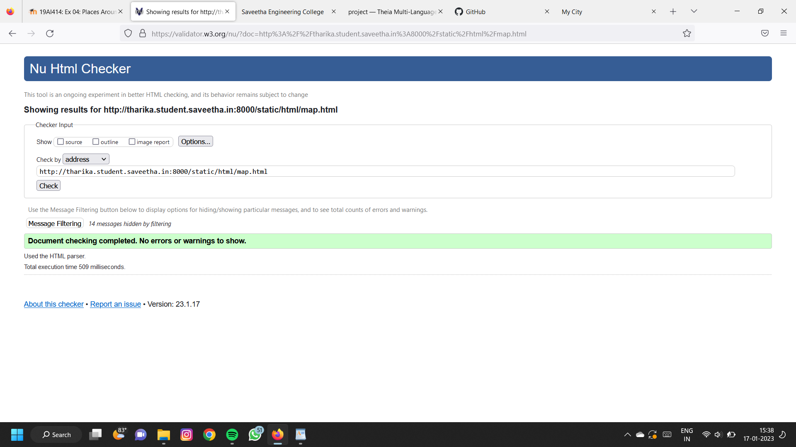

# Places Around Me
## AIM:
To develop a website to display details about the places around my house.

## Design Steps:

### Step 1:
Clone the github repository into Theia IDE
### Step 2:
Create a mew Django project
### Step 3:
Write the needed HTML code
### Step 4:
Run the Django server and execute the HTML files
## Code:
```
map.html
<!DOCTYPE html>
<html lang="en">
<head>
<title>My City</title>
</head>
<body>
<h1 align="center">
<font color="red"><b>Perambalur</b></font>
</h1>
<h3 align="center">
<font color="blue"><b>Tharika S (22001698)</b></font>
</h3>
<center>

<map name="MyCity">
<area shape="circle" coords="190,50,20" href="/static/html/collectorate.html" title="District Collector Office">
<area shape="rectangle" coords="230,30,260,60" href="/static/html/fort.html" title="Ranjankudi Fort">
<area shape="circle" coords="400,350,50" href="/static/html/Park.html" title="Butterfly Park">
<area shape="circle" coords="400,200,75" href="/static/html/hotel.html" title="Dhanalakshmi Srinivasan hotel">
<area shape="rectangle" coords="490,150,870,320" href="/static/html/clg.html" title="Roever Engineering College">
</map>
</center>
</body>
</html>

collectorate.html
<!DOCTYPE html>
<html lang="en">
<head>
<title>Collector Office</title>
</head>
<body bgcolor="cyan">
<h1 align="center">
<font color="red"><b>Perambalur</b></font>
</h1>
<h3 align="center">
<font color="blue"><b>District Collector Office</b></font>
</h3>
<hr size="3" color="red">
<p align="justify">
<font face="Courier New" size="5">
<b>
Perambalur is a town in the Indian state of Tamil Nadu. It is the headquarters of Perambalur district and Perambalur taluk (sub-district). As of 2011 census, the town had a population of 49,648.It is the largest town and administrative headquarters of Perambalur district, as well as Perambalur Taluk (Sub-District).
There are a set of 11th century Buddha statues around the villages of Perambalur called Perambalur Buddhas.
The town covers an area of 20.59 sq.km.[1] Though a landlocked district, fossils of marine species dated 416 million years ago were found near the Kunnam taluk of the district, revealing the fact that the land was part of the ancient sea.</b>
</font>
</p>
</body>
</html>

park.html
<!DOCTYPE html>
<html lang="en">
<head>
<title>Butterfly Park</title>
</head>
<body bgcolor="yellow">
<h1 align="center">
<font color="red"><b>Perambalur</b></font>
</h1>
<h3 align="center">
<font color="blue"><b>Butterfly Park</b></font>
</h3>
<hr size="3" color="red">
<p align="justify">
<font face="Tahoma" size="5">
A very nice park near Collectorate Office. It is located surrounding the Preeti Swimming Pool. 
Very superb calm place in perambalur. Best for walking. Nice playing place for kids.
Well maintained with jogging track. Source of ground water.
Good place play with children.  In Banyan Tree lot of parrot stay like house. 
Good sound and Air. Water view park looks awesome.
Very nice place at Perambalur.
Simple and relax with play area.
</font>
</p>
</body>
</html>

hotel.html
<!DOCTYPE html>
<html lang="en">
<head>
<title>Dhanalakshmi Srinivasan Hotel</title>
</head>
<body bgcolor="pink">
<h1 align="center">
<font color="red"><b>Perambalur</b></font>
</h1>
<h3 align="center">
<font color="blue"><b>Dhanalakshmi Srinivasan Hotel</b></font>
</h3>
<hr size="3" color="red">
<p align="justify">
<font face="Arial" size="5">
<b>
Dhanalakshmi Srinivasan Hotel is located near by the New Bus Stand in the heart of Perambalur District, on the way to the District Collectorate Complex Perambalur. It is located approximately 1 km inward from the Chennai - Trichy National Highway NH - 45 towards Perambalur District.
Dhanalakshmi Srinivasan Hotel offers a range of facilities and services to its guests like business centre, laundry services, travel desk, taxi services, doctor on call, valet parking, airport pick-up and drop, and safe deposit lockers.
Dhanalakshmi Srinivasan Hotel is a quality 3 star property that attracts visitors from various parts of the country as this is located at a convenient location to enjoy comfortable accommodation, a host of facilities and services, as well as warm hospitality and one of its kind at Perambalur District, TamilNadu.
</b>
</font>
</p>
</body>
</html>

fort.html
<!DOCTYPE html>
<html lang="en">
<head>
<title>Ranjankudi Fort</title>
</head>
<body bgcolor="lime">
<h1 align="center">
<font color="red"><b>Perambalur</b></font>
</h1>
<h3 align="center">
<font color="blue"><b>Ranjankudi Fort</b></font>
</h3>
<hr size="3" color="red">
<p align="justify">
<font face="Georgia" size="5">
Ranjankudi Fort is a 15th-century fortress located about 16 km (9.9 mi) north of the town of Perambalur in Tamil Nadu, India.Ranjakudi fort was the focus point during the Battle of Valikondah during 1751, when the British troops supported by Mohammed Ali won over the French supported by Chanda Sahib. The fort is oblong in shape with semicircular bastions, a moat encircling it and three fortifications at different levels, built with cut stone blocks.
The fort is called Ranjankudikottai and also referred as Nanjankudikottai. The old premises is believed to have been housing Hindu temples dedicated to Shiva and Hanuman.[1][2] The fort is believed to have been constructed by Vijayanagar Nayaka Kings. Then it was occupied by the Nawab of Carnatic during the 17th century. The fort was the scene of the Battle of Valikondah during 1751. 
</font>
</p>
</body>
</html>

clg.html
<!DOCTYPE html>
<html lang="en">
<head>
<title>Engineering clg</title>
</head>
<body bgcolor="orange">
<h1 align="center">
<font color="red"><b>Perambalur</b></font>
</h1>
<h3 align="center">
<font color="blue"><b>Roever Engineering College</b></font>
</h3>
<hr size="3" color="red">
<p align="justify">
<font face="Georgia" size="5">
Roever Engineering College is an ISO 9001:2008 certified institution established in the year 2001 by St.John Sangam Trust . Roever Engineering College is a Co-Educational engineering college in Perambalur, Elambalur Village (PO). Roever Engineering College is affiliated to Anna University, Chennai. This college is sized with 25 acres of land. Roever Engineering College is recognized by AICTE, New Delhi.
</font>
</p>
</body>
</html>
```

## Output:


## HTML Validator


## Result:
The program for implementing image map is executed successfully